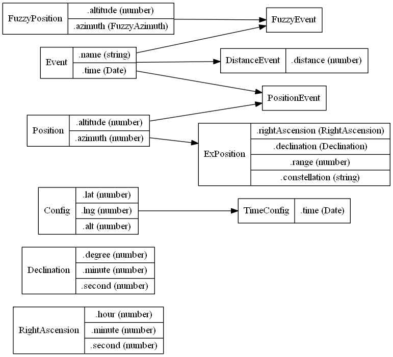

### Types and Interfaces



#### <a id="fuzzy-azimuth"></a> Type: FuzzyAzimuth

Fuzzy azimuth. One of `"N"`, `"NNE"`, `"NE"`, `"ENE"`, `"E"`, `"ESE"`, `"SE"`, `"SSE"`, `"S"`, `"SSW"`, `"SW"`, `"WSW"`, `"W"`, `"WNW"`, `"NW"`, `"NNW"`

#### <a id="ra"></a> Interface: RightAscension

Describes right ascension.

- `hour`: [`<number>`][number] Hour part of the right ascension.

- `minute`: [`<number>`][number] Minute part of the right ascension.

- `second`: [`<number>`][number] Second part of the right ascension.

#### <a id="declination"></a> Interface: Declination

Describes declination.

- `degree`: [`<number>`][number] Degree part of the declination.

- `minute`: [`<number>`][number] Minute part of the declination.

- `second`: [`<number>`][number] Second part of the declination.

#### <a id="config"></a> Interface: Config

Base config including observation location params.

- `latitude`: [`<number>`][number] Latitude of the observation location (degree). **Default:** `0`

- `longtitude`: [`<number>`][number] Longitude of the observation location (degree). **Default:** `0`

- `elevation`: [`<number>`][number] Elevation of the observation location (meter). **Default:** `0`

```typescript
{
    latitude: 40,
    longtitude: 116,
    elevation: 50
}
```

#### <a id="time-config"></a> Interface: TimeConfig

Config including observation time.

- Every properties in [`<Config>`](#config)

- `time`: [`<Date>`][date] Observation time. **Default:** `new Date()`

#### <a id="event"></a> Interface: Event

Basic event including name and time.

- `name`: [`<string>`][string] Name of the event.

- `time`: [`<Date>`][date] Time of the event.

#### <a id="distance-event"></a> Interface: DistanceEvent

Event including distance.

- Every properties in [`<Event>`](#event)

- `distance`: [`<number>`][number] Distance of the event (km).

#### <a id="position"></a> Interface: Position

Basic position including altitude and azimuth.

- `altitude`: [`<number>`][number] Altitude of the position (degree).

- `azimuth`: [`<number>`][number] Azimuth of the position (degree).

#### <a id="ex-position"></a> Interface: ExPosition

Position including more data.

- Every properties in [`<Event>`](#event)

- `rightAscension`: [`<RightAscension>`](#ra) Right ascension of the position.

- `declination`: [`<Declination>`](#declination) Declination of the position.

- `range`: [`<number>`][number] Range (distance) of the position (in AU if not specified).

- `constellation`: [`<string>`][string] The constellation which the position belongs to.

#### <a id="position-event"></a> Interface: PositionEvent

Event including position.

- Every properties in [`<Event>`](#event)

- Every properties in [`<Position>`](#position)


#### <a id="fuzzy-position"></a> Interface: FuzzyPosition

Basic position including altitude and azimuth.

- `altitude`: [`<number>`][number] Altitude of the position (degree).

- `azimuth`: [`<FuzzyAzimuth>`](#fuzzy-azimuth) Azimuth of the position (degree).

#### <a id="fuzzy-event"></a> Interface: FuzzyEvent

Event including fuzzy position.

- Every properties in [`<Event>`](#event)

- Every properties in [`<FuzzyPosition>`](#fuzzy-position)

---

[date]: https://developer.mozilla.org/en-US/docs/Web/JavaScript/Reference/Global_Objects/Date
[number]: https://developer.mozilla.org/en-US/docs/Web/JavaScript/Data_structures#Number_type
[string]: https://developer.mozilla.org/en-US/docs/Web/JavaScript/Data_structures#String_type
